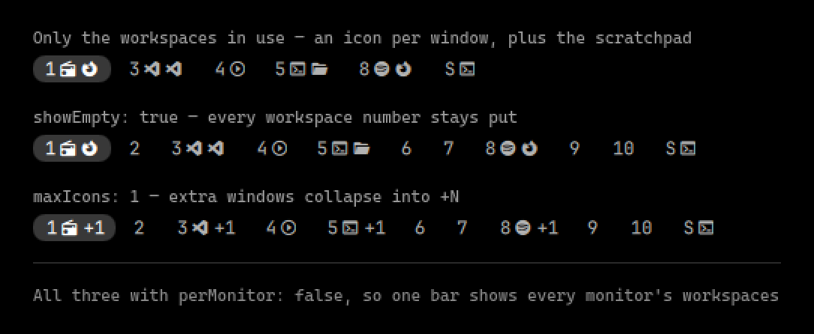

AI Generated, didn't even look at the code, but does the job.
I actually created this manually for waybar in the past... ain't doing that again ;)

# Decent Workspaces



A bar widget for Omarchy Quattro that shows workspaces the way you actually use
them:

- **Only workspaces in use.** Empty workspaces are hidden. The workspace you are
  currently on always stays visible even when empty, so the bar never goes blank
  underneath you.
- **Only this monitor's workspaces.** Each bar instance filters to the monitor it
  lives on, and highlights *that monitor's* active workspace. The highlight is
  softer on monitors that don't currently hold keyboard focus, so you can tell at
  a glance where you are.
- **App icons beside the number.** Every open window on a workspace contributes a
  Nerd Font glyph next to the workspace number.

Click a workspace to focus it; scroll anywhere over the widget to step through
workspaces.

## Install

```bash
omarchy plugin add https://github.com/TheTrueFerret/omarchy-decent-workspaces.git --enable
omarchy bar put io.github.thetrueferret.decent-workspaces --section left --index 1
```

You probably want to drop the stock widget at the same time, since two workspace
indicators side by side is rarely what you want:

```bash
omarchy plugin disable omarchy.workspaces
```

## Settings

Set these on the widget's entry in `~/.config/omarchy/shell.json`, or with
`omarchy bar set io.github.thetrueferret.decent-workspaces <key> <value>`:

| Key | Default | Meaning |
| --- | --- | --- |
| `perMonitor` | `true` | Show only workspaces belonging to this bar's monitor. Set `false` to show all of them on every bar. |
| `showEmpty` | `false` | Show workspace numbers that have no windows, up to `maxWorkspaceId`. |
| `showIcons` | `true` | Draw an app icon per open window. |
| `maxIcons` | `0` | Cap icons per workspace, collapsing the rest to `+N`. `0` means no cap. |
| `maxWorkspaceId` | `10` | Highest workspace id to consider. |

Example — cap icons at four and keep empty workspaces visible:

```bash
omarchy bar set io.github.thetrueferret.decent-workspaces maxIcons 4 --json
omarchy bar set io.github.thetrueferret.decent-workspaces showEmpty true --json
```

## Adding an app icon

Icons live in `IconRules.js` as an ordered list of `{ pattern, icon }`. The
pattern is a case-insensitive regex tested against the window title first and
the window class second, and the **first match wins** — so title-specific rules
have to sit above generic class rules, or an Amazon tab in Firefox would render
the Firefox icon.

To find the class of a window you want to add:

```bash
hyprctl clients -j | jq -r '.[] | "\(.class)\t\(.title)"'
```

Then add a rule and save; the shell hot-reloads local plugins.

## Uninstall

```bash
omarchy plugin remove io.github.thetrueferret.decent-workspaces
```

## Development

```bash
omarchy plugin validate ~/.config/omarchy/plugins/io.github.thetrueferret.decent-workspaces
qmllint -I ~/.local/share/omarchy/shell Workspaces.qml
qs log -i "$(qs list --all | awk '/^Instance/ {print substr($2, 1, length($2)-1); exit}')"
```

## Credits

The icon map is adapted from the `saif.workspaces` plugin by Saif Omar (MIT).

## License

MIT
